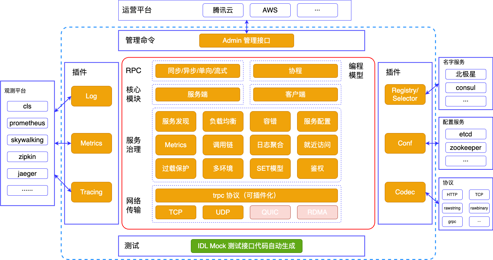

[English](README.md) | 中文

# tRPC-Go Framework

tRPC-Go，是 [tRPC][] 的 [Go][] 语言实现，它是一个可插拔的高性能 RPC 框架。

更多信息见：[快速上手][quick start] 以及 [详细文档][docs] 

## 整体架构

tRPC-Go 具有以下特点：

- 一个进程内可以同时启动多个服务，并监听多个地址。
- 所有的组件都是可插拔的，内置了各种基本功能的默认实现，可以进行替换。其他组件可以由第三方实现并注册到框架中。
- 所有的接口都可以进行模拟测试，使用 gomock&mockgen 生成 mock 代码，方便进行测试。
- 框架支持任意的第三方协议，只需要实现协议的打包和解包接口即可。默认支持 trpc 和 http 协议，可以随时切换。
- 提供了 [trpc 命令行工具][trpc-cmdline] 用于生成代码模板。

## 相关文档

- [快速上手][quick start] 以及 [详细文档][docs]
- 各个目录下的 README 文档
- [trpc 命令行工具][trpc-cmdline]
- [helloworld 开发指南][helloworld]
- [各种特性的示例文档][features]

## 相关生态

- [协议插件][go-codec]
- [拦截器插件][go-filter]
- [数据库插件][go-database]
- [更多生态...][ecosystem]

## 如何贡献

如果您有兴趣进行贡献，请查阅[贡献指南][contributing]并检查 [issues][] 中未分配的问题。认领一个任务，让我们一起为 tRPC-Go 做出贡献。

[Go]: https://golang.org
[tRPC]: https://github.com/trpc-group/trpc
[trpc-cmdline]: https://github.com/trpc-group/trpc-cmdline
[docs]: /docs/README.zh_CN.md
[quick start]: /docs/quick_start.zh_CN.md
[go-releases]: https://golang.org/doc/devel/release.html
[contributing]: CONTRIBUTING.md
[issues]: https://github.com/trpc-group/trpc-go/issues
[go-codec]: https://github.com/trpc-ecosystem/go-codec
[go-filter]: https://github.com/trpc-ecosystem/go-filter
[go-database]: https://github.com/trpc-ecosystem/go-database
[ecosystem]: https://github.com/orgs/trpc-ecosystem/repositories
[helloworld]: /examples/helloworld/
[features]: /examples/features/

## 版权声明

The copyright notice pertaining to the Tencent code in this repo was previously in the name of “THL A29 Limited.”  That entity has now been de-registered.  You should treat all previously distributed copies of the code as if the copyright notice was in the name of “Tencent.”
