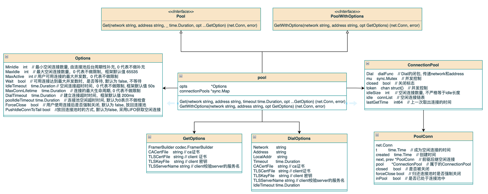
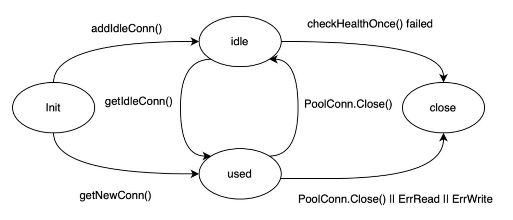

English | [中文](README.zh_CN.md)

## Background

When client requests server, if the communication is conducted using TCP protocol, the cost of establishing a connection with the three-way handshake needs to be considered. In general, TCP communication mode will pre-establish a connection, or establish a connection when the request is initiated. After using the connection, it will not be directly closed, but will be reused later.

Connection pool is a certain degree of encapsulation to achieve this function.

## Principle

The pool maintains a `sync.Map` as a connection pool, the key is encoded by <network, address, protocol>, and the value is the ConnectionPool formed by the connection established with the target address, and a linked list is used to maintain idle connections inside. In short connection mode, the transport layer closes the connection after the RPC call, while in the connection pool mode, the used connection is returned to the connection pool to be taken out when needed next time.

To achieve the above purposes, the connection pool needs to have the following functions:

- Provide available connections, including creating new connections and reusing idle connections.
- Recycling the connections used by the upper layer as idle connection management.
- Manage the idle connections in the connection pool, including the selection policy for reusing connections, and health checks on idle connections.
- Adjust the running parameters of the connection pool according to user configuration.

## Design Implementation

Its overall code structure is shown in the figure below



### Initialize the Connection Pool

`NewConnectionPool` creates a connection pool and supports passing in `option` to modify parameters. If no options are passed, the default values will be used for initialization. `Dial` is the default method for creating connections, and each `ConnectionPool` generates `DialOptions` based on its `GetOptions` to establish a connection to the corresponding target.

```go
func NewConnectionPool(opt ...Option) Pool {
  opts := &Options{
    MaxIdle: defaultMaxIdle,
    IdleTimeout: defaultIdleTimeout,
    DialTimeout: defaultDialTimeout,
    Dial: Dial,
  }
  for _, o := range opt {
    o(opts)
  }
  return &pool{
    opts: opts,
    connectionPools: new(sync.Map),
  }
}
```

### Get a Connection

A connection can be obtained through `pool.Get`, refer to the implementation of `client_transport_tcp.go`:

```go
// Get
getOpts := connpool.NewGetOptions()
getOpts.WithContext(ctx)
getOpts.WithFramerBuilder(opts.FramerBuilder)
getOpts.WithDialTLS(opts.TLSCertFile, opts.TLSKeyFile, opts.CACertFile, opts.TLSServerName)
getOpts.WithLocalAddr(opts.LocalAddr)
getOpts.WithDialTimeout(opts.DialTimeout)
getOpts.WithProtocol(opts.Protocol)
conn, err = opts.Pool.Get(opts.Network, opts.Address, getOpts)
```

`ConnPool` only exposes the `Get` interfaces to the outside world, ensuring that the connection pool status is not damaged by user error.

`Get` gets the `ConnectionPool` according to `<network, address, protocol>`. If the acquisition fails, you need to create it first. Concurrency control is done here to prevent the `ConnectionPool` from being created repeatedly. The core code is as follows:

```go
func (p *pool) Get(network string, address string, opts GetOptions) (net.Conn, error) {
  // ...
  key := getNodeKey(network, address, opts.Protocol)
  if v, ok := p.connectionPools.Load(key); ok {
    return v.(*ConnectionPool).Get(ctx)
  }
  // create newPool...
  v, ok := p.connectionPools.LoadOrStore(key, newPool)
  if !ok {
    // init newPool...
    return newPool.Get(ctx)
  }
  return v.(*ConnectionPool).Get(ctx)
}
```

After obtaining the `ConnectionPool`, an attempt is made to obtain a connection. First, a `token` needs to be obtained. The `token` is a `ch` used for concurrency control, and its buffer length is based on `MaxActive`. It represents the number of connections that the user can use at the same time. When an active connection is returned to the connection pool or closed, the `token` is returned. If `Wait=True` is set, it will wait until a timeout is returned when the `token` cannot be obtained. If `Wait=False` is set, `ErrPoolLimit` will be returned directly when the `token` cannot be obtained.

```go
func (p *ConnectionPool) getToken(ctx context.Context) error {
  if p.MaxActive <= 0 {
    return nil
  }
    
  if p.Wait {
    select {
    case p.token <- struct{}{}:
      return nil
    case <-ctx.Done():
      return ctx.Err()
    }
  } else {
    select {
    case p.token <- struct{}{}:
      return nil
    default:
      return ErrPoolLimit
    }
  }
}

func (p *ConnectionPool) freeToken() {
  if p.MaxActive <= 0 {
    return
  }
  <-p.token
}
```

After the `token` is successfully obtained, the idle connection is first obtained from the `idle list`, and if it fails, the newly created connection returns.

### Initialize the ConnectionPool

Initialization of the `ConnectionPool` should be performed when using `Get`, which is mainly divided into starting the check coroutine and preheating idle connections based on `MinIdle`.

#### KeepMinIdles

A sudden surge in business traffic may result in the creation of a large number of new connections. Creating a connection is a time-consuming operation and may result in request timeouts. Pre-creating some idle connections can have a preheating effect. When the connection pool is created, MinIdle connections are created for backup.

#### Check Goroutine

The ConnectionPool periodically performs the following checks:

- Idle connection health check

  The default health check strategy is shown in the figure below. The health check scans the idle list. If the connection fails the security check, it will be closed directly. First, the connection is checked for normality, and then checked for reaching `IdleTimeout` and `MaxConnLifetime`. `With WithHealthChecker`, the health check policy can be customized.

  In addition to periodically checking idle connections, a check is performed each time an idle connection is retrieved from the `idle list`. At this time, isFast is set to true and only a connection survival confirmation is performed.

  ```go
  func (p *ConnectionPool) defaultChecker(pc *PoolConn, isFast bool) bool {
    if pc.isRemoteError(isFast) {
      return false
    }
    if isFast {
      return true
    }
    if p.IdleTimeout > 0 && pc.t.Add(p.IdleTimeout).Before(time.Now()) {
      return false
    }
    if p.MaxConnLifetime > 0 && pc.created.Add(p.MaxConnLifetime).Before(time.Now()) {
      return false
    }
    return true
  }
  ```

  The detection time for idle connections in the connection pool should generally be made configurable to coordinate with the server side (especially considering different framework scenarios), as improper coordination can lead to issues. For example, if the detection time for idle connections in the pool is 1 minute, and the server also has a 1-minute detection time, the following scenario may occur: when the server closes idle connections intensively, the client side has not yet detected it. As a result, a large number of failures may occur when sending data, which can only be resolved by retrials on the upper layer. A better solution is to set the idle connection detection duration for the server to be longer than that for the connection pool, as much as possible to allow the client side to actively close the connection, thereby avoiding the situation where the retrieved connection is closed by the server without the client's knowledge.

  > There is actually an optimization idea here, which is to perform a non-blocking read through a system call each time a connection is retrieved, which can actually determine whether the connection has been closed by the peer. This is available on Unix/Linux platforms, but encountered some problems on Windows platforms, so this optimization point was removed in tRPC-Go.

- Idle connection count check:

  Same as `KeepMinIdles`, periodically replenishes the idle connections to `MinIdle`.

- ConnectionPool idle check:

  The `transport` will not actively close the `ConnectionPool`, which will cause the background check coroutine to run idly. By setting `poolIdleTimeout`, periodic checks are performed within this time period to ensure that `ConnectionPool` that have not been used for a long time are automatically closed when the number of connections used by the users is 0.

## Connection life cycle

`MinIdle` is the minimum number of idle connections maintained by the `ConnectionPool`, which is replenished during initialization and periodic checks. When a user requests a connection, it first tries to retrieve one from the idle connections; if there are no idle connections available, a new one is created. After the user finishes the request, the connection is returned to the `ConnectionPool`. There are three possible scenarios:

- If the number of idle connections exceeds `MaxIdle`, one idle connection will be closed based on the elimination strategy.
- If `forceClose` for the connection pool is set to `true`, the connection will be closed directly instead of being returned to the `ConnectionPool`.
- The connection will be added to the idle connection list.

If there is a read/write error during connection usage by the user, the connection will be closed directly. If the check for connection availability fails, the connection will also be closed directly.



## Idle Connection Management Policy

The connection pool has two strategies for selecting and eliminating idle connections: FIFO and LIFO. This is controlled by PushIdleConnToTail, and the appropriate management strategy should be chosen based on the actual characteristics of the business.

- FIFO ensures that each connection is evenly used, but when the caller's request frequency is not high, but happens to request before the connection idle condition is met each time, it will cause all connections to not be released, and maintaining so many connections is unnecessary.
- LIFO prioritizes the top connection of the stack, and idle connections at the bottom that are not frequently used will be eliminated first.

```go
func (p *ConnectionPool) addIdleConn(ctx context.Context) error {
  c, _ := p.dial(ctx)
  pc := p.newPoolConn(c)
  if !p.PushIdleConnToTail {
    p.idle.pushHead(pc)
  } else {
    p.idle.pushTail(pc)
  }
}

func (p *ConnectionPool) getIdleConn() *PoolConn {
  for p.idle.head != nil {
    pc := p.idle.head
    p.idle.popHead()
    // ...
  }
}

func (p *ConnectionPool) put(pc *PoolConn, forceClose bool) error {
  if !p.closed && !forceClose {
    if !p.PushIdleConnToTail {
      p.idle.pushHead(pc)
    } else {
      p.idle.pushTail(pc)
    }
    if p.idleSize >= p.MaxIdle {
      pc = p.idle.tail
      p.idle.popTail()
    }
  }
}
```

